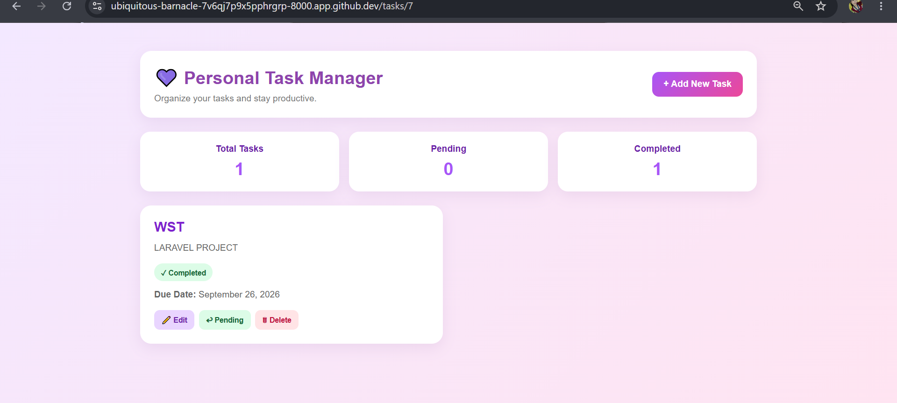
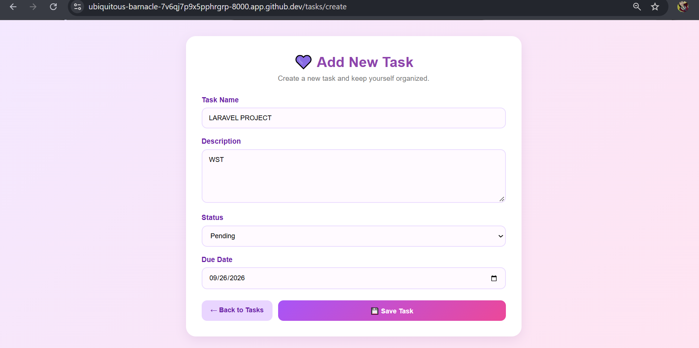
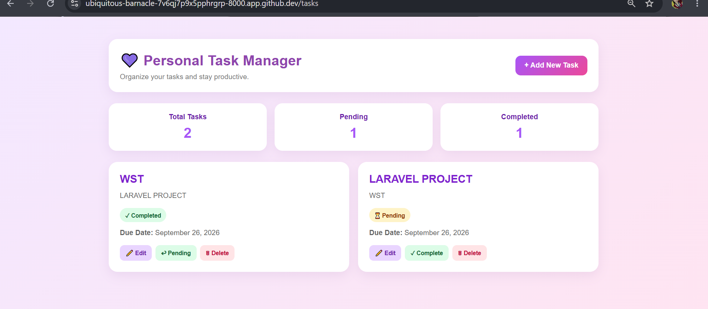
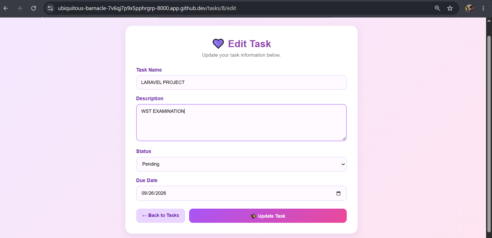
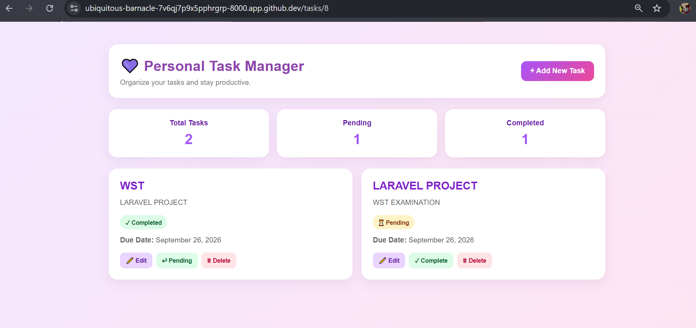
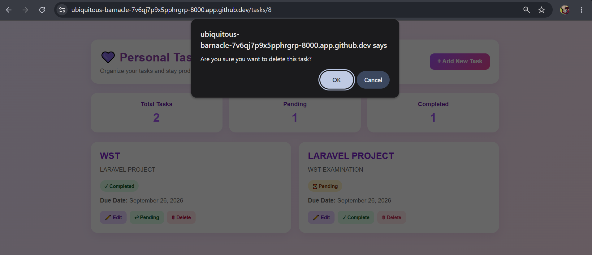
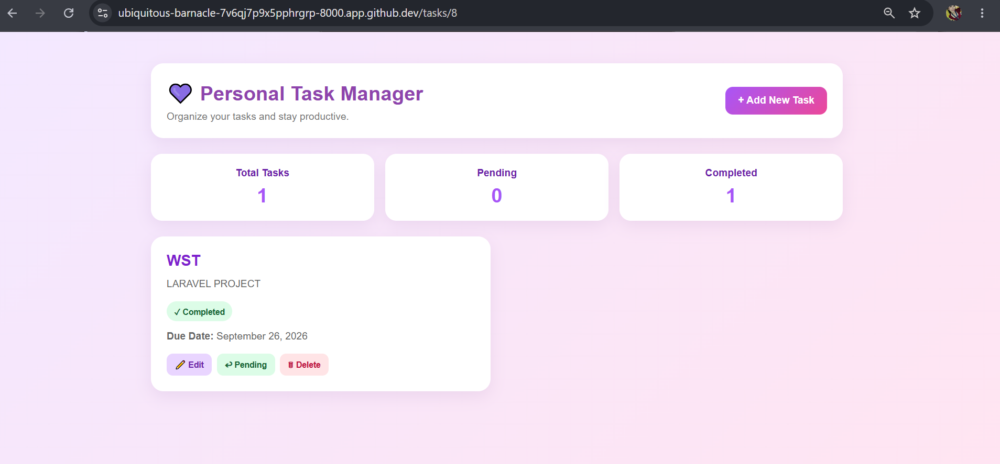

# Personal Task Manager

## Project Code
WST21-PM-2026-SF

## Student Name
ALTAMERA , MAE ANN F.

## Course & Year
BSIT-2 SEC-9  -   2026

## Database Used
SQLite

## Features
- Add Task
- View Tasks
- Edit Task
- Delete Task
- Update Status

## Dashboard / View Tasks

### Add Task

The Add Task feature allows users to create a new task.

### Result Add Task

### Edit Task

The Edit Task feature allows users to update existing task information.

### Result Edit Task

### Delete Task

Users can delete tasks from the task list.

### Result Delete Task

